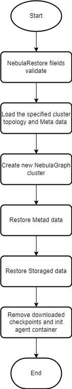

# Backup & Restore

### Requirements

* The feature is used for enterprise version
* The NebulaGraph cluster is running
* Operator version >= 1.4.0
* Set the field `enableBR` ot __true__
* Sufficient computational resources can be scheduled to restore NebulaGraph cluster(only restore scenario needed)
* S3 protocol compatible storage (AWS S3，Minio, etc.)

## Backup NebulaGraph cluster

#### Full backup

Update the [full-backup-job.yaml](../../config/samples/full-backup-job.yaml) parameters:

* $META_ADDRESS
* $BUCKET
* $ACCESS_KEY
* $SECRET_KEY
* $REGION

```shell
$ kubectl apply -f full-backup-job.yaml
$ kubectl describe job nebula-full-backup
# Pod name is shown under "Events"
$ kubectl logs logs $POD -f
```

#### Incremental backup

Update the [incremental-backup-job.yaml](../../config/samples/incremental-backup-job.yaml) parameters:

* $META_ADDRESS
* $BUCKET
* $ACCESS_KEY
* $SECRET_KEY
* $REGION

```shell
$ kubectl apply -f incremental-backup-job.yaml
$ kubectl describe job nebula-incr-backup
# Pod name is shown under "Events"
$ kubectl logs logs $POD -f
```

## Restore NebulaGraph cluster

The restore flow:



Update the [apps_v1alpha1_nebularestore.yaml](../../config/samples/apps_v1alpha1_nebularestore.yaml) fields:

* clusterName
* backupName
* concurrency
* S3 storage sections
* secret aws-s3-secret data access-key and secret-key

```yaml
apiVersion: v1
kind: Secret
metadata:
  name: aws-s3-secret
type: Opaque
data:
  access-key: <ACCESS_KEY>
  secret-key: <SECRET_KEY>
---
apiVersion: apps.nebula-graph.io/v1alpha1
kind: NebulaRestore
metadata:
  name: restore1
spec:
  br:
    # The name of the restore nebula cluster
    clusterName: nebula
    # The name of the backup file.
    backupName: "BACKUP_2023_02_05_04_36_41"
    # Used to control the number of concurrent file downloads during data restoration. 
    # The default value is 5.
    concurrency: 5
    s3:
      # Region in which the S3 compatible bucket is located.
      region: "us-east-1"
      #  Bucket in which to store the backup data.
      bucket: "nebula-br-test"
      # Endpoint of S3 compatible storage service
      endpoint: "https://s3.us-east-1.amazonaws.com"
      #  SecretName is the name of secret which stores access key and secret key.
      secretName: "aws-s3-secret"
```

```shell
$ kubectl apply -f apps_v1alpha1_nebularestore.yaml
$ kubectl get nr restore1 -w
```

**Note:**

The operator won't remove old nebula cluster after restore successfully, you can do it manually.
