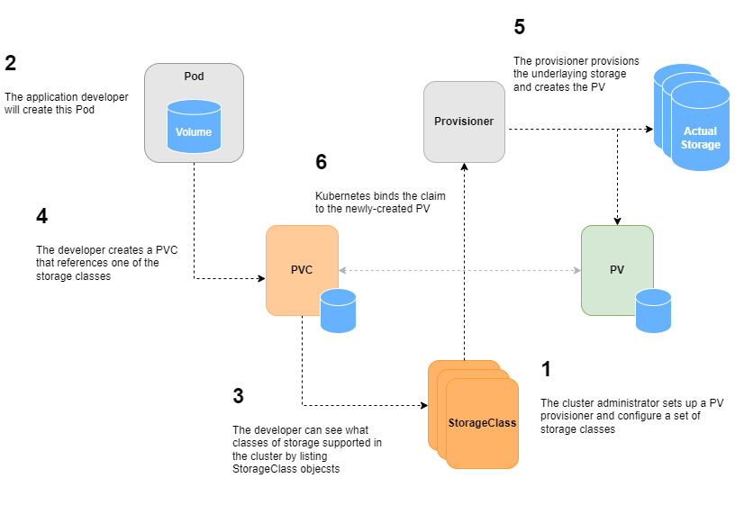

# PV Reclaim

Nebula Operator uses [PV (Persistent Volume)](https://kubernetes.io/docs/concepts/storage/persistent-volumes/) to store
persistent data. If you accidentally delete a NebulaGraph cluster, the PV objects and data are still retained to ensure
data safety.

We provide a parameter `enablePVReclaim` in CRD to control whether reclaim the PV or not.

If you need release the storage volumes and don't want to retain the data, you can update your nebula instance and set
the parameter `enablePVReclaim` to __true__.

**The details you should know:**

PVs are created automatically by the system administrator or volume provisioner. PVs and Pods are bound by
PersistentVolumeClaim (PVC). Users request for using a PV through a PVC instead of creating a PV directly. The
corresponding volume provisioner creates a PV that meets the requirements of PVC and then binds the PV to the PVC.

PersistentVolumes that are dynamically created by a StorageClass will have the reclaim policy specified in the
reclaimPolicy field of the class, which can be either Delete or Retain. If no reclaimPolicy is specified when a
StorageClass object is created, it will default to Delete.
This means that a dynamically provisioned volume is automatically deleted when a user deletes the corresponding
PersistentVolumeClaim. This automatic behavior might be inappropriate if the volume contains precious data. In that
case, it is more appropriate to use the "Retain" policy. With the "Retain" policy, if a user deletes a
PersistentVolumeClaim, the corresponding PersistentVolume will not be deleted. Instead, it is moved to the Released
phase, where all of its data can be manually recovered.

The reclaim policy of a StorageClass is set at creation time, and it cannot be updated once it is created. If it is not
set when created, you can create another StorageClass of the same provisioner.